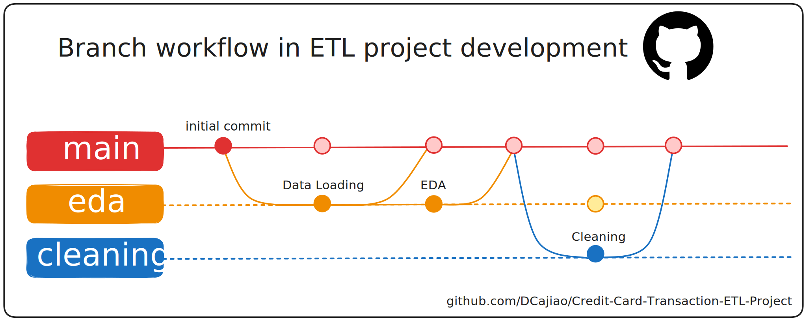

<center>

# 💳 Credit-Card-Transaction-ETL-Project

</center>

## 🫂Team dev

* [David Alejandro Cajiao Lazt](https://github.com/DCajiao)
* [Sebastián Ortiz](https://github.com/sebas1193)
* [Juan Andrés López Alvarez](https://github.com/Juananalv205)


## ❓ What is this?

This is a data analysis project, which covers the creation of a complete ETL (Extract, Transform, Load) process to analyze data related to banking transactions. The objective of this project is to develop a complete data collection, exploration, processing, loading and visualization process based on the best practices in data engineering.

### 🔨 Technologies Used

- 🐍**Python**: The main programming language used for data extraction, transformation, and loading.
- 📦**Poetry**: A tool for dependency management and packaging in Python projects.
- 📒**Jupyter Notebooks**: Used for data exploration, cleaning, and analysis.
- 🗄️**SQL**: For database management and querying.
- ☁️**Render**: A cloud service used to deploy databases.
- 📊**Pandas, NumPy, Matplotlib**: Libraries for data manipulation and visualization.
- 📈**Looker**: Final dashboard viewer.

## 📦 What’s in this repo?

This repository contains everything needed to replicate and understand the entire ETL process, organized into the following directories:

```plaintext
/Credit-Card-Transaction-ETL-Project/
│
├── /docs/                          # Project documentation
│   ├── how_to_deploy_databases_on_render.md # Guide for deploying databases on Render
│   └── /img/                       # Images used in the documentation
│       ├── Branch-workflow.svg     # Diagram 1
│       └── Pipeline-diagram.svg    # Diagram 2
├── /notebooks/                     # Jupyter Notebooks used for exploratory analysis and development
│   ├── 00_data_load.ipynb          # Data loading into Postgres
│   ├── 01_EDA.ipynb                # Data exploration
│   └── 02_cleaning.ipynb           # Data cleaning
│
├── /reports/                       # Reports generated during the project
│   ├── /dashboard/                 # Dashboards and visual reports
│   │   └── ETL-Credit-Card-Transaction-Dashboard.pdf  # Final report pdf
│   └── /pdf/                   # Folder with the final pdf report
│       └── ETL_Project_-_First_Delivery_Credit_Card_Transactions.pdf # Final report 
│
├── /sql/                           # SQL scripts used in the project
│   ├── schema.sql                  # Database schema definition
│   ├── schema_clean.sql            # Database clean schema definition
│   ├── /queries/                   # Frequently used or complex SQL queries
│   │   ├── 001_view_tables.sql     # View tables in the database
│   │   ├── 002_drop_tables.sql     # Drop tables from the database
│   │   ├── 003_view_tables_sizes.sql # View sizes of tables in the database
│   │   ├── 004_get_raw_data.sql    # Query to retrieve raw data
│   │   └── 005_get_clean_data.sql  # Query to retrieve cleaned data
│
├── /src/                           # Project source code
│   ├── /connections/               # Database connection scripts
│   │   └── db.py                   # Script for database connection
│   │
│   ├── /utils/                     # Utility functions for the project
│       ├── credentials_management.py # Script for managing credentials
│       └── pysqlschema.py            # Script for managing SQL schemas with Python
│
├── .gitignore                      # Files and folders to be ignored in version control
├── pyproject.toml                  # Poetry configuration file for managing dependencies and scripts
└── README.md                       # General project overview
```

## ▶️ How do I run this repo?

### Requirements

Before getting started, make sure you have the following installed:

- Python 3.8 or higher
- Poetry 1.1.8 or higher

### Installation

1. **Clone the repository:**

   ```bash
   git clone https://github.com/DCajiao/Credit-Card-Transaction-ETL-Project
   cd Credit-Card-Transaction-ETL-Project
   ```

2. **Install dependencies with Poetry:**

   ```bash
   poetry install
   ```

   This command will install all necessary dependencies as defined in the `pyproject.toml` file.

3. **Activate the Poetry virtual environment:**

   ```bash
   poetry shell
   ```

4. **Configure environment variables:**

   Ensure that the `.env` file is properly configured with your database credentials and any other necessary parameters.

### Running the Pipeline

Once your environment is set up, you can run the ETL scripts by following the steps in the Jupyter Notebooks or by executing the scripts directly from the `src/` directory.

---

## 🛣️ Data Pipeline Diagram


## 🔀 Branch Workflow Diagram
Since this project was developed in a collaborative way, the following workflow was proposed.



## 📊 Final Dashboard & Report

* Online Version: [Looker dashboard](https://lookerstudio.google.com/reporting/eb61cdd8-7cbe-4817-a99f-32de2e9089fc)
* Offline Version: [PDF](https://github.com/DCajiao/Credit-Card-Transaction-ETL-Project/tree/main/reports/dashboard/ETL-Credit-Card-Transaction-Dashboard.pdf)
* Report of project: [Documentation](https://github.com/DCajiao/Credit-Card-Transaction-ETL-Project/tree/main/reports/pdf/ETL_Project_-_First_Delivery_Credit_Card_Transactions.pdf)

## 🎯 Additional information on this project

* A custom package was built to automate sql script generation. Take a look at the [documentation](https://github.com/DCajiao/workshop001_candidates_analysis/blob/main/docs/app/PySQLSchema.md) and the [script](https://github.com/DCajiao/workshop001_candidates_analysis/blob/main/src/utils/pysqlschema.py).

* Write [documentation](https://github.com/DCajiao/workshop001_candidates_analysis/blob/main/docs/database/how_to_deploy_databases_on_render.md) on how to create and use a free instance on Render

---
