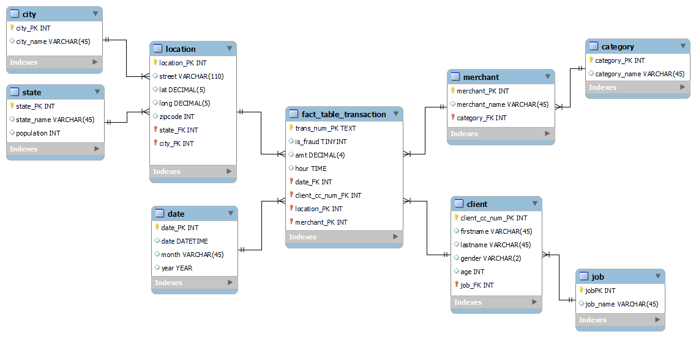

# Credit-Card-Transaction-Airflow-ETL-Project

## Credit Card Transaction Dimensional Model ❄️

This dimensional model is designed to analyze transactions, including fraud information, clients, locations, merchants, and more. The model follows a **Snowflake Schema**, with the `location` dimension being normalized into separate tables for `city`, `state`, and `country`.

### Fact Table: `fact_table_transaction`
The fact table contains numerical data and foreign keys needed to analyze transactions.

- **Fields:**
  - `trans_num_PK`: (TEXT) Primary key that identifies each transaction.
  - `is_fraud`: (TINYINT) Indicates whether the transaction was fraudulent.
  - `amt`: (DECIMAL) Transaction amount.
  - `hour`: (TIME) Time of the transaction.
  - `date_FK`: (INT) Foreign key referencing the `date` table.
  - `client_cc_num_FK`: (INT) Foreign key referencing the `client` table.
  - `location_PK`: (INT) Foreign key referencing the `location` table.
  - `merchant_PK`: (INT) Foreign key referencing the `merchant` table.

### Dimension Tables

1. **`date` Dimension**  
   The `date` table stores date and time information for the transactions.
   - **Fields:**
     - `date_PK`: (INT) Primary key for the date.
     - `date`: (DATETIME) Full date and time.
     - `month`: (VARCHAR) Transaction month.
     - `year`: (YEAR) Transaction year.

2. **`client` Dimension**  
   The `client` table stores details about the client associated with each transaction.
   - **Fields:**
     - `client_cc_num_PK`: (INT) Client’s primary key.
     - `firstname`: (VARCHAR) Client’s first name.
     - `lastname`: (VARCHAR) Client’s last name.
     - `gender`: (VARCHAR) Client’s gender.
     - `age`: (INT) Client’s age.
     - `job_FK`: (INT) Foreign key referencing the `job` table.

3. **`location` Dimension**  
   The `location` table stores information about where the transaction occurred and is normalized into separate tables for `city`, `state`, and `country`.
   - **Fields:**
     - `location_PK`: (INT) Primary key for the location.
     - `street`: (VARCHAR) Street address where the transaction took place.
     - `lat`: (DECIMAL) Latitude of the location.
     - `long`: (DECIMAL) Longitude of the location.
     - `zipcode`: (INT) Zip code.
     - `state_FK`: (INT) Foreign key referencing the `state` table.
     - `city_FK`: (INT) Foreign key referencing the `city` table.
     - `country_code_FK`: (VARCHAR) Foreign key referencing the `country` table.

4. **`merchant` Dimension**  
   The `merchant` table stores details about the merchant involved in each transaction.
   - **Fields:**
     - `merchant_PK`: (INT) Merchant’s primary key.
     - `merchant_name`: (VARCHAR) Merchant’s name.
     - `category_FK`: (INT) Foreign key referencing the `category` table.

5. **`category` Dimension**  
   The `category` table stores the categories of the merchants.
   - **Fields:**
     - `category_PK`: (INT) Primary key for the category.
     - `category_name`: (VARCHAR) Category name.

6. **`job` Dimension**  
   The `job` table stores the occupation or job of the client.
   - **Fields:**
     - `job_PK`: (INT) Primary key for the job.
     - `job_name`: (VARCHAR) Job title.

7. **`state` Dimension**  
   The `state` table stores information about the state/province where the transaction occurred.
   - **Fields:**
     - `state_PK`: (INT) Primary key for the state.
     - `state_name`: (VARCHAR) State name.
     - `population`: (INT) Country population.

8. **`city` Dimension**  
   The `city` table stores information about the city where the transaction occurred.
   - **Fields:**
     - `city_PK`: (INT) Primary key for the city.
     - `city_name`: (VARCHAR) City name.

9. **`country` Dimension**  
   The `country` table stores information about the country where the transaction occurred.
   - **Fields:**
     - `country_code_PK`: (VARCHAR) Primary key for the country.
     - `name`: (VARCHAR) Country name.

### Snowflake Schema ❄️

Unlike the **Star Schema**, the **Snowflake Schema** normalizes some of the dimension tables into smaller related tables. In this model, the **location** dimension is normalized into **state**, **city**, and **country** tables, which reduces data redundancy but may require more joins in queries.

---