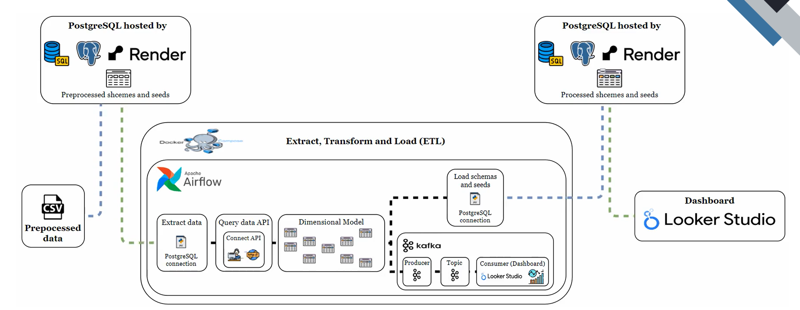
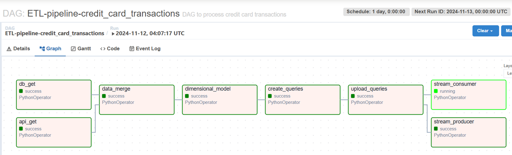

# Credit Card Transaction ETL Project with Airflow 🚀

A comprehensive ETL pipeline to process and analyze credit card transactions using Apache Airflow, Docker, and PostgreSQL. This project automates data extraction from APIs and databases, data transformation to build dimensional models, and data loading into a database for analysis, supporting a scalable and efficient ETL process.



## Project Overview 🎯

The Credit Card Transaction ETL project orchestrates a data pipeline that extracts, transforms, and loads transaction data into a relational database. Designed to handle large volumes of credit card transactions, it uses Airflow for scheduling, Docker for containerization, and PostgreSQL for data storage, enabling seamless data management, analysis, and insights.


### Features

- **Automated Extraction**: Extracts data from REST APIs and SQL databases.
- **Data Transformation**: Cleans, merges, and processes data into meaningful dimensions.
- **Database Loading**: Loads transformed data into PostgreSQL tables for efficient querying.
- **Scalable & Maintainable**: Built with modularity for scalable and maintainable ETL workflows.

## Table of Contents 📜

- [Project Overview](#project-overview-)
- [Architecture](#architecture-)
- [Dimensional Model Diagram](#credit-card-transaction-dimensional-model-️)
- [Getting Started](#getting-started-)
- [ETL Pipeline in Airflow](#etl-pipeline-in-airflow-)
- [Directory Structure](#directory-structure-)
- [How to Use](#how-to-use-)
- [License](#license-)

## Credit Card Transaction Dimensional Model ❄️


This dimensional model is designed to analyze transactions, including fraud information, clients, locations, merchants, and more. The model follows a **Snowflake Schema**, with the `location` dimension being normalized into separate tables for `city`, `state`, and `country`.

To get more information about Database Fields, look at: 
[Documentation](https://github.com/DCajiao/Credit-Card-Transaction-ETL-Project/tree/feature/kafka/docs/Documentation.pdf)

### Snowflake Schema ❄️

Unlike the **Star Schema**, the **Snowflake Schema** normalizes some of the dimension tables into smaller related tables. In this model, the **location** dimension is normalized into **state**, **city**, and **country** tables, which reduces data redundancy but may require more joins in queries.

## Architecture 🏛️

The pipeline uses Apache Airflow for orchestrating a series of tasks that:
1. **Extract Data**: Pulls transaction data from an external API and a database.
2. **Transform Data**: Processes raw data to create fact and dimension tables (e.g., `transaction_dim`, `category_dim`, `client_dim`).
3. **Load Data**: Loads transformed tables into PostgreSQL for data persistence and analysis.

### Key Technologies

- **Apache Airflow**: Manages task dependencies and schedules workflows.
- **Docker**: Ensures a consistent, isolated environment across different stages.
- **PostgreSQL**: Stores the structured transaction data for efficient querying and analytics.

## Getting Started 🔧

Follow these instructions to set up and run the project locally.

### Prerequisites

- **Docker** and **Docker Compose** for containerization.
- **Git** for cloning the repository.

### Installation

1. **Clone the Repository**:
   ```bash
   git clone https://github.com/DCajiao/Credit-Card-Transaction-ETL-Project.git
   cd Credit-Card-Transaction-ETL-Project
   ```

2. **Create the .env file**:
   Create a .env file in the ./src/ directory with the following content:

   ```bash
   DBNAME = your_name_db_on_render
   DBUSER = your_user
   DBPASS = your_password
   DBHOST = your_host_on_render
   DBPORT = 5432 (optional) you can change it.
   ```

3. **Environment Setup**:
   The project is Dockerized. Run the following command to build and start the containers:
   ```bash
   docker-compose up airflow-init
   ```

   ```bash
   docker-compose up --build
   ```
   This command:
   - Builds images for Airflow, PostgreSQL, and Redis.
   - Initializes Airflow metadata and starts webserver and scheduler.

3. **Access the Airflow UI**:
   - Once running, access Airflow at `http://localhost:8080` (username/password default is `airflow/airflow`).
   - The PostgreSQL database is accessible at `localhost:5432`.

### Database Configuration

The pipeline uses PostgreSQL as the main data warehouse. `docker-compose.yml` initializes the database and creates required tables, ensuring compatibility with the ETL process.

## ETL Pipeline in Airflow 💡

### DAG Workflow

The ETL pipeline consists of three main tasks orchestrated by Airflow:
1. **API Data Extraction (`api_get`)**: Retrieves data from an external API.
2. **Database Data Extraction (`db_get`)**: Fetches data from a database.
3. **Data Merge (`data_merge`)**: Combines API and database data into a unified DataFrame.
4. **Dimensional Modeling (`dimensional_model`)**: Transforms data into fact and dimension tables.
5. **Query Generation (`create_queries`)**: Creates SQL schema and seed data files for each dimension.
6. **Data Upload (`upload_queries`)**: Loads generated queries and schemas into the database for analysis.

### [📽️ Watch a video of the execution here](docs/evidences/execution.mp4)
Each task is modularized for flexibility and scalability, allowing for updates to data sources, transformations, or database configurations with minimal changes to the codebase.

### Key DAGs and Tasks


- **Extract Data DAG**: Retrieves raw transaction data from external sources.
- **Transform Data DAG**: Applies transformations, merges data sources, and constructs dimensions and fact tables.
- **Load Data DAG**: Loads the transformed data into PostgreSQL tables.

## Directory Structure 📁

```plaintext
Credit-Card-Transaction-ETL-Project/
├── dags/                        # Airflow DAGs defining ETL workflow
├── src/                         # Source scripts for extraction, transformation, and loading
│   ├── connections/             # Database connection scripts
│   └── utils/                   # Utility functions
├── sql/                         # Generated SQL schemas and seed data
├── config/                      # Configuration files for database and environment settings
└── docker-compose.yml           # Docker Compose file for service orchestration
```
## Final Dashboard 📊:
Take a look at the dashboard with your preferred option: 

[Offline (PDF)](reports/dashboard/002_ETL-Credit-Card-Transaction-Dashboard.pdf)

[Online](https://lookerstudio.google.com/reporting/b6d54cef-c15d-4174-83c1-a78a3e0ca405)


## How to Use 📊

1. **Start the ETL Process**:
   - In the Airflow UI, enable and trigger the DAG to initiate the ETL process.
   
2. **Monitor the Pipeline**:
   - View task statuses, logs, and outputs in the Airflow UI.
   
3. **Access Data for Analysis**:
   - Once the pipeline completes, query the data in PostgreSQL to analyze transaction trends and insights.

4. **Customize the Pipeline**:
   - Update configurations in `src/`, `dags/`, or `config/` to adjust data sources, transformations, or database connections.

## License 📄

This project is licensed under the MIT License - see the [LICENSE](LICENSE) file for details.
